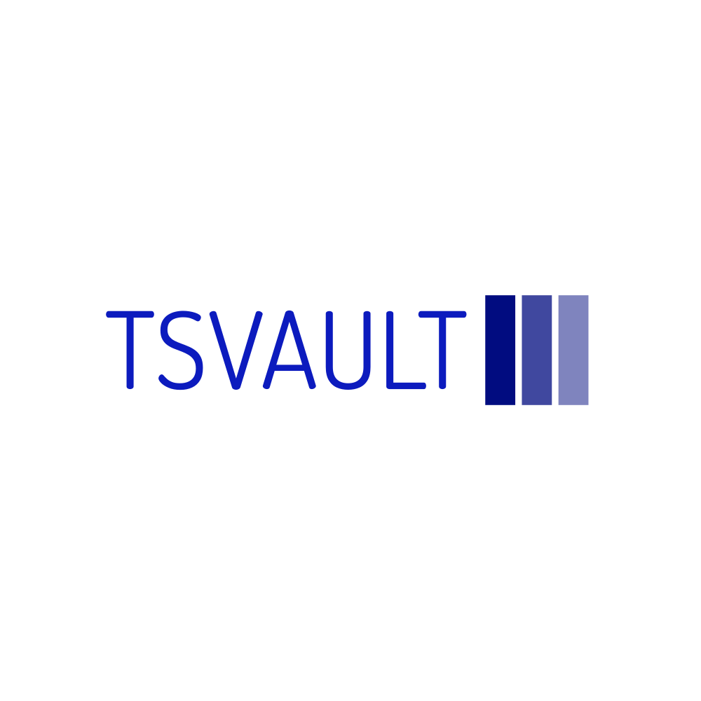

# TSVault

## about

Tutorials, models and utility functions for time series analysis.

## utilities

Useful utility functions are explained in `utility/learn_utilities.ipynb` notebook. Also, functions we would use to handle time series are organized in `utilities/utilities.py`.

## time series with natural language processing

Notebook `natural_language_processing/ds_beach_demand_nlp.ipynb` shows how you can use NLP techniques to build a deep learning forecasting model. The model forecasts the demand for each (store, item) tuple using historical sales as well as item descriptions. In other words, the relationship between items is captured through item descriptions. The notebook is based on the notebook and youtube by Dr. Jeff Heaton. You can find his video on [Youtube](https://youtu.be/zN3LlMOFqxM). I have modified the code, used my tested time series utility functions.
